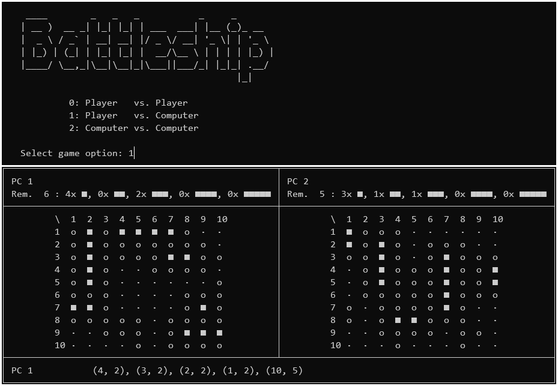

# Battleship



## System requirements

Make sure that `Python 3` is installed on the target system.

## Installation

```console
git clone https://github.com/zhukovdm/battleship
cd src/
python3 battleship.py
```

## Gameplay

The gameplay is intuitive, just follow the instructions.

For more information about game internals, please visit project documention
(en | [cz](./assets/doc/cz.pdf)).

## References

[Wikipedia - Battleship (game)](https://en.wikipedia.org/wiki/Battleship_(game))
