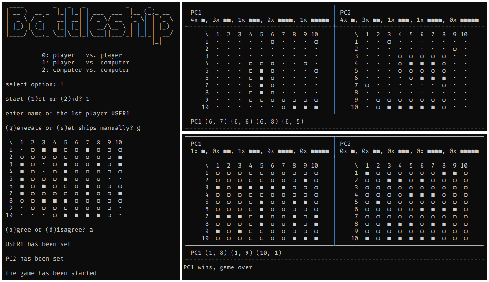

# Battleship

## Introduction

A `Python` implementation of the board game [Battleship](https://en.wikipedia.org/wiki/Battleship_(game))



## System requirements

Make sure that `Python 3` is installed on the target system.

## Installation

```console
git clone https://github.com/zhukovdm/battleship
cd battleship/src/
python3 battleship.py
```

## Gameplay

The gameplay is intuitive, just follow the instructions.
